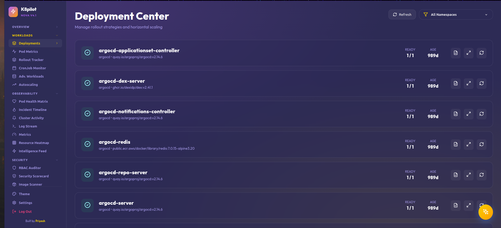

# 🛰️ k8pilot v3.5: The Orion Update

**k8pilot** is a next-generation, AI-powered Kubernetes dashboard designed for DevOps engineers who need more than just a list of pods. It combines real-time observability, security auditing, and a proactive **Intelligence Engine** into a stunning, themeable interface.



---

## 😫 The Pain: Why we built this
Traditional Kubernetes management is painful. We've all been there:
- **Terminal Blindness**: Staring at `kubectl get pods` across 20+ namespaces and missing the one pod that's quietly OOMKilled.
- **Troubleshooting Hell**: The endless cycle of `logs` → `describe` → `google` → `repeat`.
- **Reactive Ops**: Waiting for a Slack alert after a pod has already been down for 5 minutes.
- **Security Gaps**: Deploying images with `:latest` tags or privileged containers because "it just needs to work" for now.

**k8pilot** was built to turn this chaos into a clean, intelligent, and visually stunning control center, shifting from reactive monitoring to proactive intelligence.

---

## ✨ Key Features (The Orion Extension)

### 🛰️ Cluster Intelligence & Automation
- **Unified Intelligence Feed**: 🆕 A central activity stream capturing every cluster event (Scaling, Restarts, Deletions, Network events) in a persistent 24h timeline.
- **AI-Assisted Remediation (Auto-Fix)**: 🪄 For any failing resource, K8pilot generates specific "Fix Proposals" (exact YAML patches) to resolve CrashLoops or OOMs in one click.
- **Namespace Health Map**: 📊 A visual health heatmap scoring every environment based on real-time and historical incident churn.
- **AI Pod Doctor**: Deep root-cause analysis of pod failures with actionable remediation steps.

### 🛡️ Next-Gen Security & Compliance
- **Security Scorecard (GPA)**: Instant compliance grading for every namespace based on RBAC, container privileges, and network policies.
- **TLS Auditor**: 🆕 Dedicated view for auditing secrets, certificates, and security-sensitive configuration data.
- **RBAC Security Explorer**: Audit cluster access with a clean matrix of `ClusterRoles`, `Roles`, and `RoleBindings`.
- **Workload Scanning**: Automatic detection of privileged containers, root execution, and host path exposures.

### 🚀 Peak DevOps & Infrastructure Control
- **Network Listen (Lite)**: 🆕 Live, high-performance service relationship traffic & flow monitoring (replaces the heavy topology map).
- **Ghost Inspector**: 🆕 Automated detection and purging of "Zombie" resources (unused ConfigMaps, Secrets, and PVCs).
- **Infrastructure Cost Profiler**: Estimated monthly cluster burn rate calculated by namespace based on live resource requests.
- **Cluster Pulse (Heatmap)**: Real-time CPU/Memory intensity matrix showing workload pressure across the entire cluster.
---

## 🎨 Premium Themes (The Prism Update)
- **Eye-Friendly Accuracy**: 🆕 Replaced high-contrast neon themes with a curated suite of professional color palettes.
- **Elite Presets**: Includes high-end developer favorites like **Catppuccin Mocha**, **Tokyo Night**, **One Dark**, **Night Owl**, **Monokai Pro**, and **IBM Carbon**.
- **OLED Density**: Optimized dark modes (**Deep Sea**, **Obsidian**, **Vesper**) for maximum efficiency and visual comfort during long-haul debugging sessions.
- **Glassmorphism Focus**: Every theme is tuned to maintain the premium glass-blur aesthetic of the Orion interface.

---

## 🛠️ Technology Stack
- **Frontend**: React, TypeScript, Vite
- **Styling**: Vanilla CSS (Premium Glassmorphism Design System)
- **Backend**: Node.js (Express) with persistent event buffering
- **Kubernetes**: Native integration via `@kubernetes/client-node`

---

## 🚀 Quick Start

### 1. Build and Push
```bash
docker build -t docker.io/cerebro46/k8pilot:beta .
docker push docker.io/cerebro46/k8pilot:beta
```

### 2. Deploy to Kubernetes

**One-Command Deployment (Orion Tier)**
```bash
kubectl apply -f deploy/k8pilot-full.yaml
```

> [!IMPORTANT]
> **Orion v3.5 Updates**: The new **Network Listen** and **Ghost Inspector** features require list/watch permissions for `endpoints` and `endpointslices`. Ensure your `deploy/rbac.yaml` is up to date with the latest v3.5 permissions to avoid empty data views!

### 3. Access the Dashboard
Expose via LoadBalancer or Port-Forward:
```bash
kubectl port-forward svc/k8pilot-service 5000:80 -n k8pilot
```
Default Credentials: `admin` / `admin123` (Configurable via Env Vars).

---

## 🔒 Environment Variables
| Variable | Description | Default |
|----------|-------------|---------|
| `JWT_SECRET` | Secret for session signing | `k8pilot-super-secret-2026` |
| `ADMIN_USER` | Dashboard username | `admin` |
| `ADMIN_PASSWORD` | Dashboard password | `admin123` |

---

## 🤝 Contributing
Built with ❤️ by [Priyesh](https://github.com/priyesh2). Feel free to open issues or submit PRs for new Orion-tier intents or themes!
